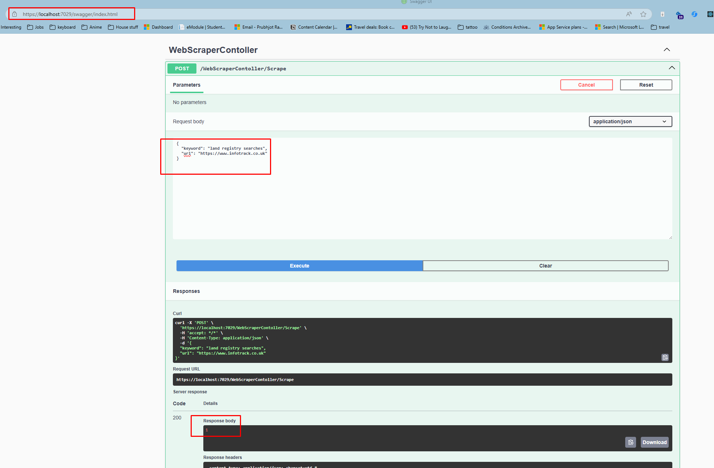
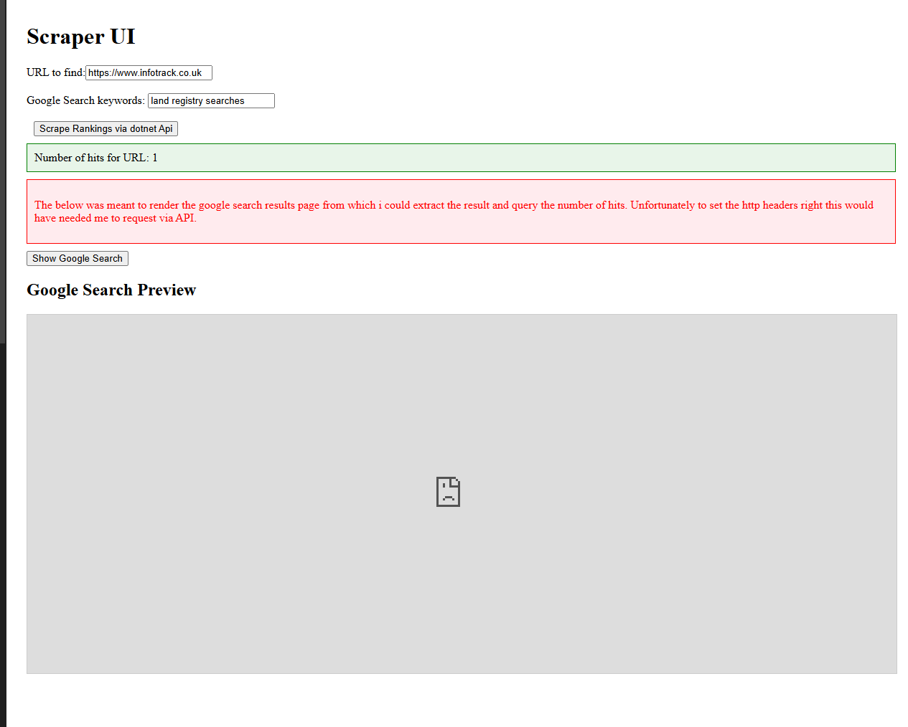

# Launching the Application

Follow build instructions for API then UI.

# ScraperAPI

## Build

To run the API locally, navigate to the project root directory in your terminal and execute:

```bash
dotnet run --launch-profile "https"
```
Alternatively open the solution and hit ctrl+f5

Sample request
`
{
  "keyword": "land registry searches",
  "url": "https://www.infotrack.co.uk"
}
`
Successful launch will see the below spawn when using VS or when navigating to `https://localhost:7029/swagger/index.html` if launched via cmd.



## Design Approach

My API implementation attempts to follow Command Query Responsibility Segregation (CQRS) principles in a rudimentary manner. It utilizes the Mediator pattern (via the MediatR library) to decouple the request handling logic.

- **Requests:** Incoming API requests (like the scrape request) are mapped to specific Query objects (`ScrapeQuery`).
- **Handlers:** Each Query has a corresponding Handler (`ScrapeHandler`) responsible for executing the core logic associated with that query.
- **Validators:** FluentValidation is used to define Validators (`ScrapeRequestValidator`) that ensure the incoming request data is valid before it reaches the handler.

This allowed me to test out several different methods on how to query google. Unfortunately due to google blocking all methods except their API to run a search query, and the task requiring me not to use third party apis, I also couldnt use something like playwright to run search queries either. 

I tried solutions that involved using a local browser but I am unfamilliar with this and couldnt get it working. Namely the service `NativeBrowserSearchService` and `WebView2SearchService`.

Ultimately much to my dissapointment, due to not having too much time to spend on this task, I decided to process a saved static html of https://www.google.co.uk/search?num=100&q=land+registry+search and serve this to the UI to display.


# ScraperUi

This project was generated using [Angular CLI](https://github.com/angular/angular-cli) version 19.2.8.



## About

This Angular application provides the user interface for the InfoTrack Scraper. It allows users to input keywords and a target URL. When the user initiates a scrape request, the UI sends this information to the backend .NET API (specifically, the `WebScraperController`). The backend API then performs the web scraping process based on the provided details and returns the results, which are then displayed in this UI.

## Shortcomings

Google actively blocks automated scraping of its search results pages. Initial attempts to directly fetch and parse the HTML from the backend were unsuccessful due to these protections.

Alternatively I explored rendering the Google search results page within an iframe directly in the Angular UI and attempting to extract the necessary data from the rendered content. However, this method also proved unfeasible due to cross-origin security restrictions and the complexity of reliably extracting data from the dynamically loaded iframe content.

## Current Build

The current implementation bypasses the issues with live Google scraping by using a pre-downloaded HTML file (`Services/assets/land registry search - Google Search.html`). This file contains the saved results for the specific search query `https://www.google.co.uk/search?num=100&q=land+registry+search`. The backend API parses this static HTML file and searches for the user-provided target URL within its content to determine the ranking.


## Building and Serving

To build the project navigate to UI folder and run:

```bash
ng build
```

This will compile your project and store the build artifacts in the `dist/` directory. By default, the production build optimizes your application for performance and speed.
To start a local development server, navigate to UI folder and run:

```bash
ng serve
```

Once the server is running, open your browser and navigate to `http://localhost:4200/`. The application will automatically reload whenever you modify any of the source files.

